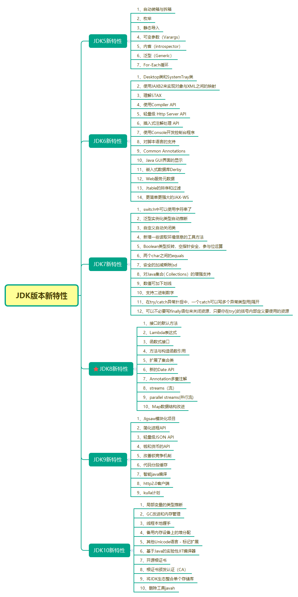

## JavaDevNote
项目说明：`Java`学习笔记，主要包含`JDK6`、`JDK7`、`JDK8`、`JDK9`、`JDK10`的学习知识点（**持续不定期更新。。。**）。
目标要求：深入源码，掌握高级用法。


## JDK版本新特性



## 学习路线图
- [**2017Java学习路线图**](http://bbs.itheima.com/thread-338415-1-1.html)
- [**2018年新版Java学习路线图**](http://bbs.itheima.com/thread-386464-1-1.html)
- [**How2J的Java教程**](http://how2j.cn/)
- [**LintCode算法练习**](https://www.lintcode.com/problem/)


## 知识目录【主要博客资料】
* Java基础
* Java进阶
  * [设计模式](advance/design_patterns.md)
  * [JVM](advance/jvm.md)
  * [并发基础](advance/concurrent.md)
  * [函数式编程（Java新特性）](advance/functional_programming.md)
* [其他](others/others.md)


## 重点知识点
- [谈谈多态](http://www.cnblogs.com/xrq730/p/4820237.html)
- [Java ThreadLocal 类的知识点解读](http://yifeng.studio/2017/10/10/java-threadlocal-class/)
- [JDK1.8 不一样的HashMap](http://www.apkbus.com/blog-487165-76822.html)


## 资料参考
- [**致力打造Java精品博客站点**](http://cmsblogs.com/)
- [Java 提高篇](http://wiki.jikexueyuan.com/project/java-enhancement/)


## License
```
 Copyright (c) 2018, The Jeterlee authors 

   Licensed under the Apache License, Version 2.0 (the "License");
   you may not use this file except in compliance with the License.
   You may obtain a copy of the License at

       http://www.apache.org/licenses/LICENSE-2.0

   Unless required by applicable law or agreed to in writing, software
   distributed under the License is distributed on an "AS IS" BASIS,
   WITHOUT WARRANTIES OR CONDITIONS OF ANY KIND, either express or implied.
   See the License for the specific language governing permissions and
   limitations under the License.
```